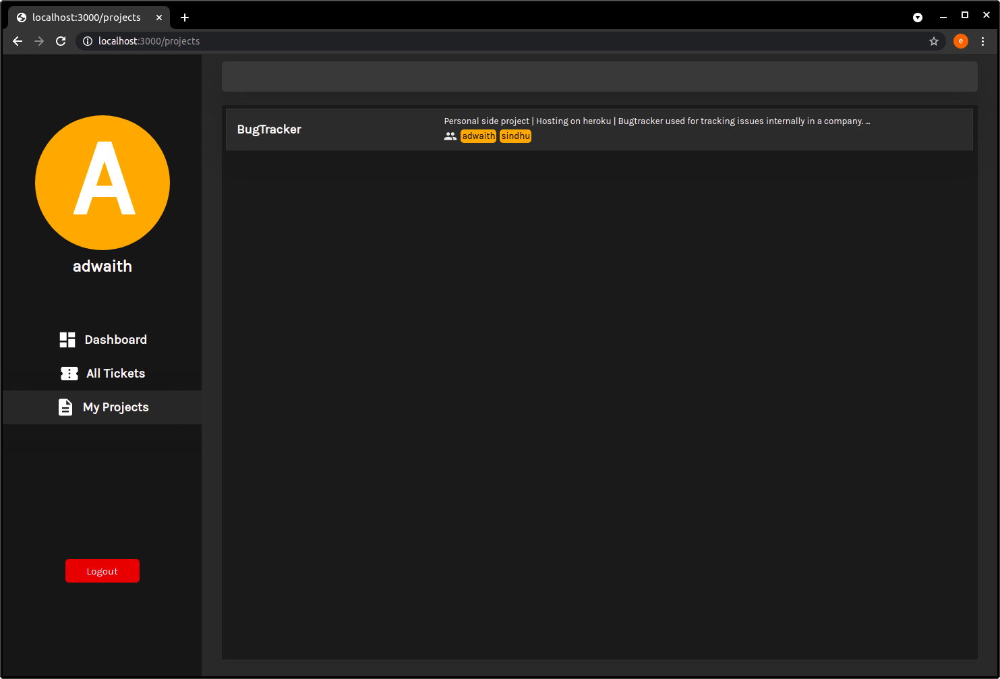

# Bug Tracker

## Description

Bug Tracking system for internal use of a company or an organization. 

## Local Setup

- Clone the repository `(git clone <url>)`
- Run `cd /BugTracker && npm install`.
- Run `npm run dev`
- Goto `http://localhost:3000/login`

## Tech Stack 

- NextJS (Framework for reactJS)
- MongoDB (Database)
- SCSS
- Typescript+Javascript

## Screenshots

### Dashboard

### All Tickets (All tickets from projects in which user is part of)

### My Projects (Projects which user is part of)

### Project Dashbord (Add/Remove participants | Create new tickets)

### Ticket (Comment, Add labels, close tickets)

